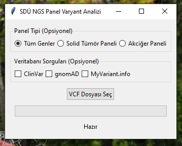

# VCF Kanser Mutasyon Analizi

Bu araç, VCF (Variant Call Format) dosyalarındaki genetik varyantları analiz ederek kanser ile ilişkili mutasyonları tespit eden ve detaylı raporlar oluşturan bir Python uygulamasıdır.



## Özellikler

- VCF dosyalarından varyant okuma
- Kanser geni tespiti ve analizi
- ClinVar veritabanı entegrasyonu
- Varyant etki analizi (frameshift, transition, transversion vb.)
- Detaylı Excel raporu oluşturma
- Görsel analiz grafikleri
- Kullanıcı dostu arayüz

## Desteklenen Kanser Genleri

- BRCA1/2 (Meme/Over Kanseri)
- TP53 (Li-Fraumeni Sendromu)
- ALK, EGFR (Akciğer Kanseri)
- KRAS (Kolorektal/Akciğer Kanseri)
- BRAF (Melanom/Kolorektal Kanser)
- Ve diğer PANEL kanser genleri

## Kurulum

```bash
# Gerekli kütüphaneleri yükleyin
pip install requests pandas matplotlib seaborn xlsxwriter
```

## Kullanım

1. Programı çalıştırın:
```bash
python vcf_analyzer.py
```

2. "VCF Dosyası Seç" butonuna tıklayın
3. Analiz edilecek VCF dosyasını seçin
4. Analiz sonuçlarını bekleyin

## Çıktılar

### Excel Raporu
- Tüm varyantlar listesi
- Kanser geni varyantları
- Yüksek etkili varyantlar
- Özet istatistikler
- Gen bazlı analizler

### Görselleştirmeler
- Varyant tipi dağılımı
- Kanser genleri dağılımı
- Kromozom dağılımı
- Varyant etki dağılımı
- Kanser geni oranı

## Gereksinimler

- Python 3.7+
- requests
- pandas
- matplotlib
- seaborn
- xlsxwriter

## Lisans

MIT

## Katkıda Bulunma

1. Fork edin
2. Feature branch oluşturun (`git checkout -b feature/AmazingFeature`)
3. Commit edin (`git commit -m 'Add some AmazingFeature'`)
4. Push edin (`git push origin feature/AmazingFeature`)
5. Pull Request oluşturun

## Teşekkürler

- UCSC Genome Browser
- ClinVar Database
- NCBI E-utilities
